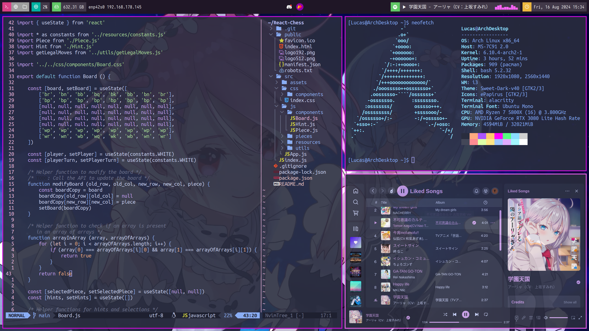
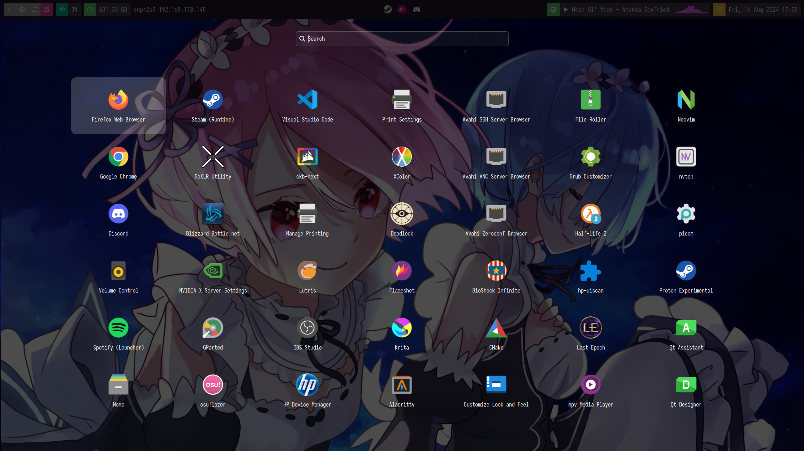
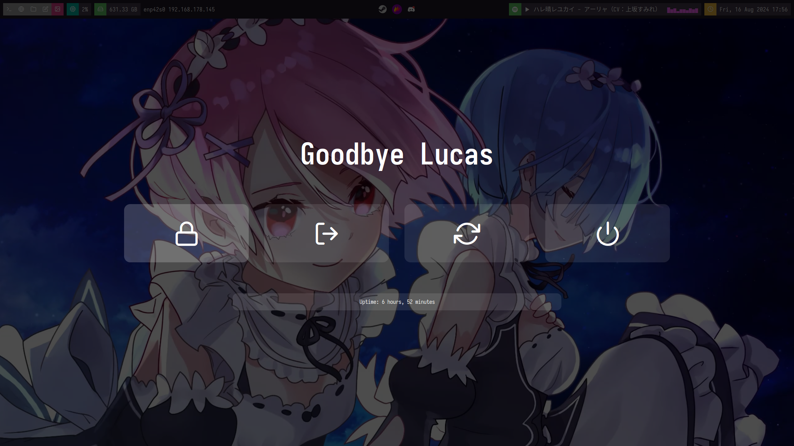
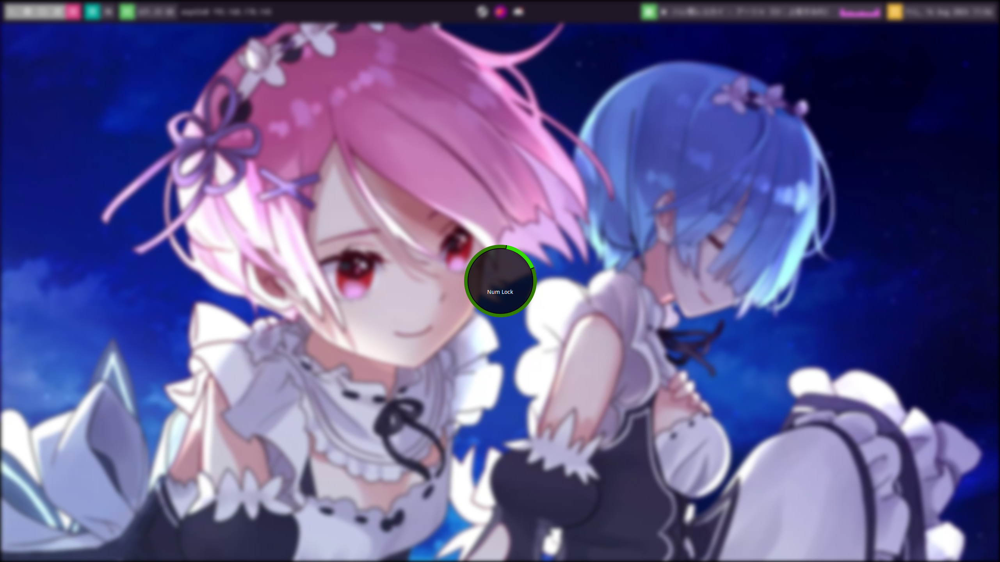

# Dotfiles

Rofi menu             |  Powermenu                     |  Lockscreen
:-------------------------:|:-------------------------:|:-------------------------:
  |    |   

# i3 config
The i3 config has some options specifically for my setup, like enabling my GoXLR or the Gnome polkit. When using this, make sure to check and modify the i3 config file in the .config/ directory to your liking.\
[I3lock-fancy-rapid-git](https://github.com/yvbbrjdr/i3lock-fancy-rapid) is used as lockscreen. This blurs the background much faster than alternatives. \
Numlock automatically gets enabled by numlockx. If you want this feature, be sure to install this package, otherwise remove it from the config.\
To set the wallpaper [(source)](https://moewalls.com/anime/ram-and-rem-rezero-live-wallpaper/), feh is used.

# Polybar
The Polybar theme used is a modified version of the blocks theme taken from [polybar-themes](https://github.com/adi1090x/polybar-themes). This Polybar requires fonts included in .local/share/fonts/.
The Spotify module is [polybar-spotify](https://github.com/Jvanrhijn/polybar-spotify/). This and the audio visualizer module require the following dependencies.

- The Python dbus module
- playerctl
- cava

# Rofi
The powermenu and application launchers are taken and modified from [ai1090x/rofi](https://github.com/adi1090x/rofi). Optionally i 

# Neovim
For Neovim, I used [vim-plug](https://github.com/junegunn/vim-plug) to maintain the plugins, to install, follow the instructions on the github repository.

# Flameshot
Flameshot has been configured to behave more like the Windows 10 snipping tool. Keybinds are present in the i3 config.

# Picom
Picom, a compositor, is used to make Alacritty and Spotify transparent.

# Wired
Wired is used to display notifications. The theme used is taken from [Archwand's](https://github.com/Toqozz/wired-notify/issues/63) mockup of Faynopi's config, listed on the same page.\

# Additional features
To get the nice looking icons in the application launcher, install [epapirus-icon-theme](https://archlinux.org/packages/extra/any/epapirus-icon-theme/) using your package manager. I use the [Sweet-Dark-v40](https://github.com/EliverLara/Sweet/releases) GTK theme to make firefox and nemo look nicer.
